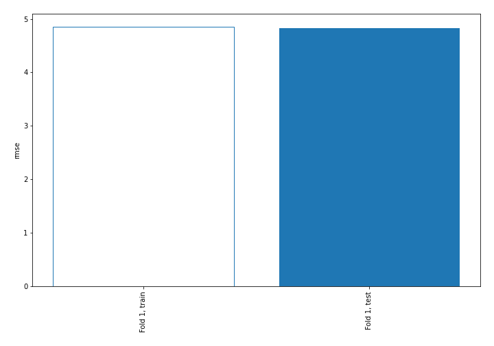
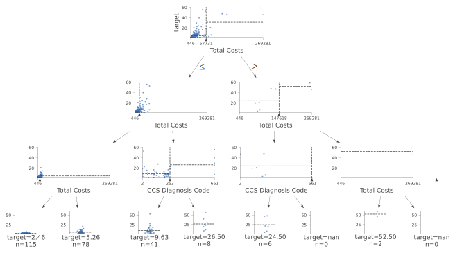
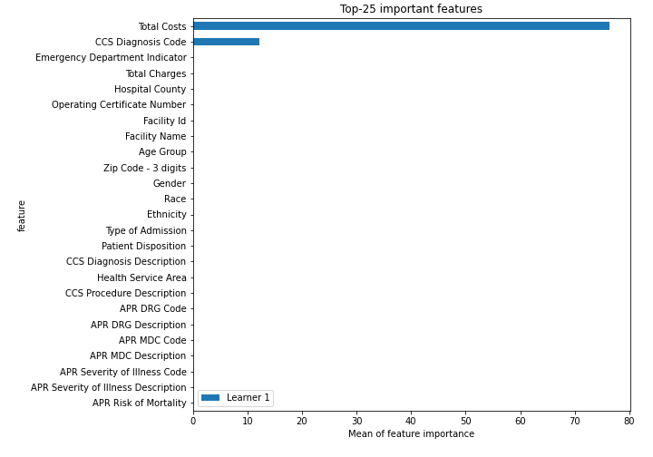
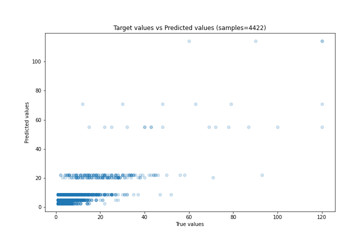
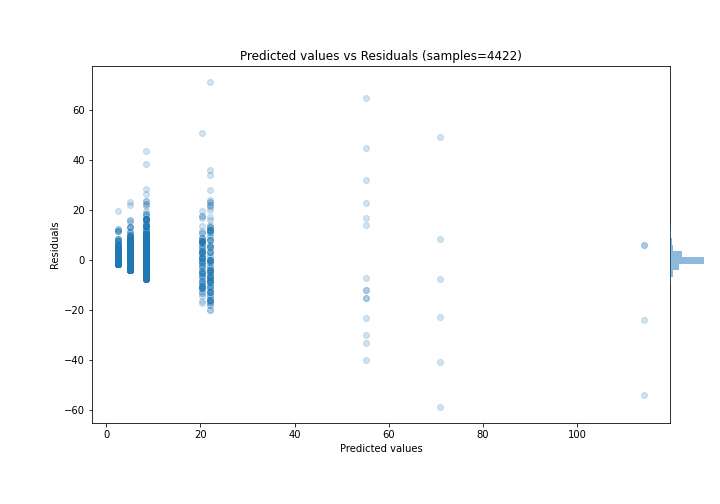
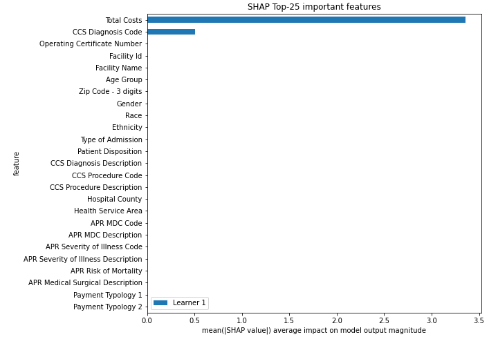
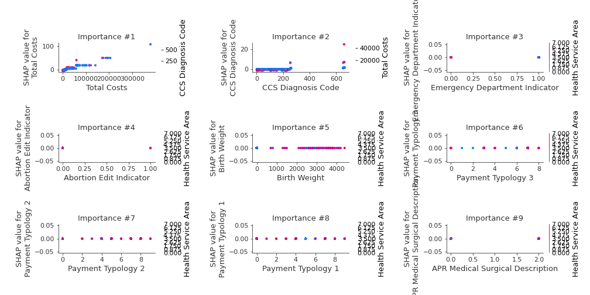
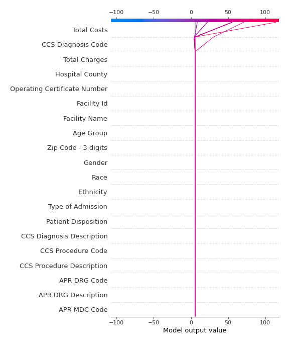

# Summary of 2_DecisionTree

[<< Go back](../README.md)

## Decision Tree
- **n_jobs**: -1
- **criterion**: mse
- **max_depth**: 3
- **explain_level**: 2

## Validation
 - **validation_type**: split
 - **train_ratio**: 0.75
 - **shuffle**: True

## Optimized metric
rmse

## Training time

13.9 seconds

### Metric details:
| Metric   |     Score |
|:---------|----------:|
| MAE      |  2.5637   |
| MSE      | 23.2463   |
| RMSE     |  4.82144  |
| R2       |  0.61517  |
| MAPE     |  0.704177 |

## Learning curves

## Decision Tree 

### Tree #1

### Rules

if (Total Costs <= 57730.549) and (Total Costs <= 17550.319) and (Total Costs <= 8486.73) then response: 2.58 | based on 6,756 samples

if (Total Costs <= 57730.549) and (Total Costs <= 17550.319) and (Total Costs > 8486.73) then response: 5.052 | based on 3,620 samples

if (Total Costs <= 57730.549) and (Total Costs > 17550.319) and (CCS Diagnosis Code <= 253.0) then response: 8.555 | based on 2,224 samples

if (Total Costs > 57730.549) and (Total Costs <= 147617.891) and (CCS Diagnosis Code <= 655.0) then response: 21.958 | based on 337 samples

if (Total Costs <= 57730.549) and (Total Costs > 17550.319) and (CCS Diagnosis Code > 253.0) then response: 20.425 | based on 228 samples

if (Total Costs > 57730.549) and (Total Costs > 147617.891) and (Total Costs <= 356876.734) then response: 55.194 | based on 72 samples

if (Total Costs > 57730.549) and (Total Costs <= 147617.891) and (CCS Diagnosis Code > 655.0) then response: 70.833 | based on 18 samples

if (Total Costs > 57730.549) and (Total Costs > 147617.891) and (Total Costs > 356876.734) then response: 114.1 | based on 10 samples

## Permutation-based Importance

## True vs Predicted

## Predicted vs Residuals

## SHAP Importance

## SHAP Dependence plots

### Dependence (Fold 1)

## SHAP Decision plots

### Top-10 Worst decisions (Fold 1)

### Top-10 Best decisions (Fold 1)

[<< Go back](../README.md)
