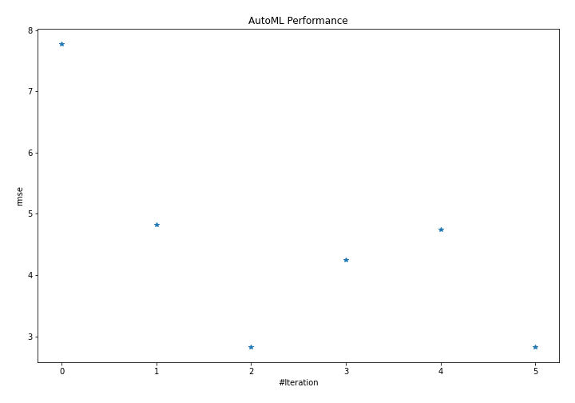
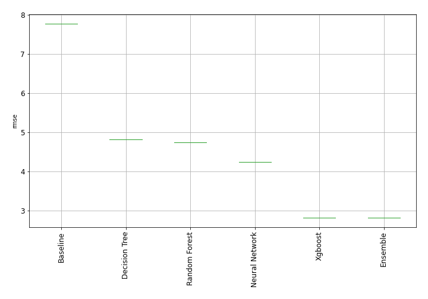
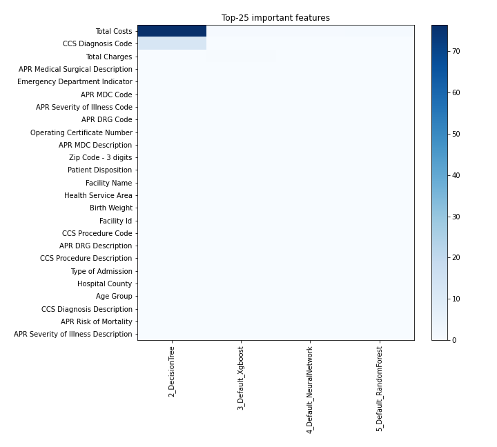
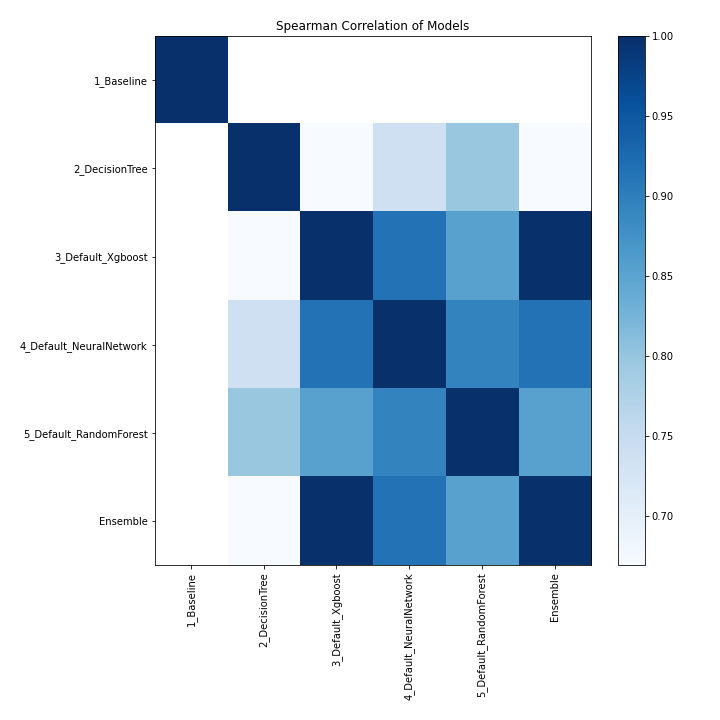

# AutoML Leaderboard

| Best model   | name                                                         | model_type     | metric_type   |   metric_value |   train_time |
|:-------------|:-------------------------------------------------------------|:---------------|:--------------|---------------:|-------------:|
|              | [1_Baseline](1_Baseline/README.md)                           | Baseline       | rmse          |        7.77225 |         2.03 |
|              | [2_DecisionTree](2_DecisionTree/README.md)                   | Decision Tree  | rmse          |        4.82144 |        14.78 |
| **the best** | [3_Default_Xgboost](3_Default_Xgboost/README.md)             | Xgboost        | rmse          |        2.8245  |        82.7  |
|              | [4_Default_NeuralNetwork](4_Default_NeuralNetwork/README.md) | Neural Network | rmse          |        4.2471  |         5.4  |
|              | [5_Default_RandomForest](5_Default_RandomForest/README.md)   | Random Forest  | rmse          |        4.74517 |        20.84 |
|              | [Ensemble](Ensemble/README.md)                               | Ensemble       | rmse          |        2.8245  |         0.53 |

### AutoML Performance

### AutoML Performance Boxplot

### Features Importance

### Spearman Correlation of Models

