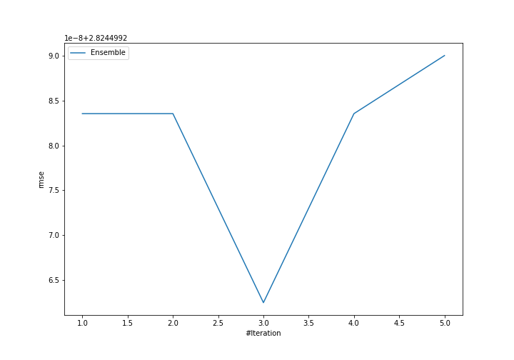
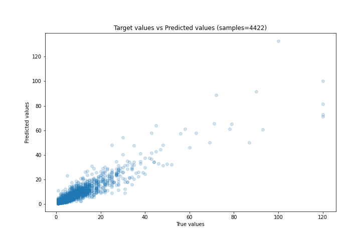
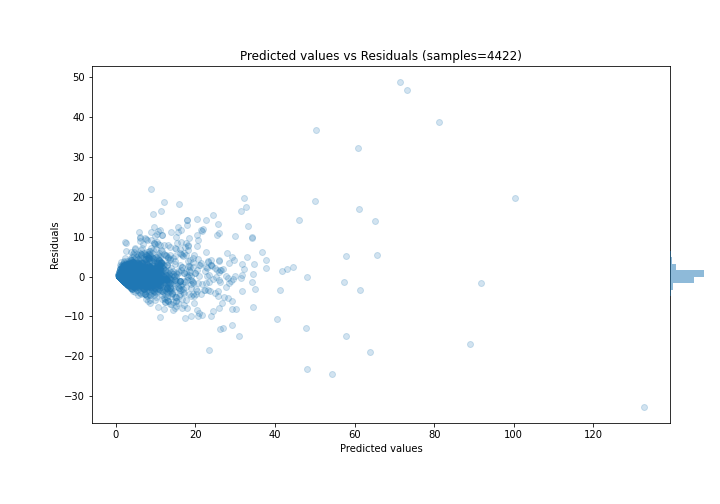

# Summary of Ensemble

[<< Go back](../README.md)

## Ensemble structure
| Model             |   Weight |
|:------------------|---------:|
| 3_Default_Xgboost |        3 |

### Metric details:
| Metric   |    Score |
|:---------|---------:|
| MAE      | 1.29023  |
| MSE      | 7.9778   |
| RMSE     | 2.8245   |
| R2       | 0.867932 |
| MAPE     | 0.260671 |

## Learning curves

## True vs Predicted

## Predicted vs Residuals

[<< Go back](../README.md)
